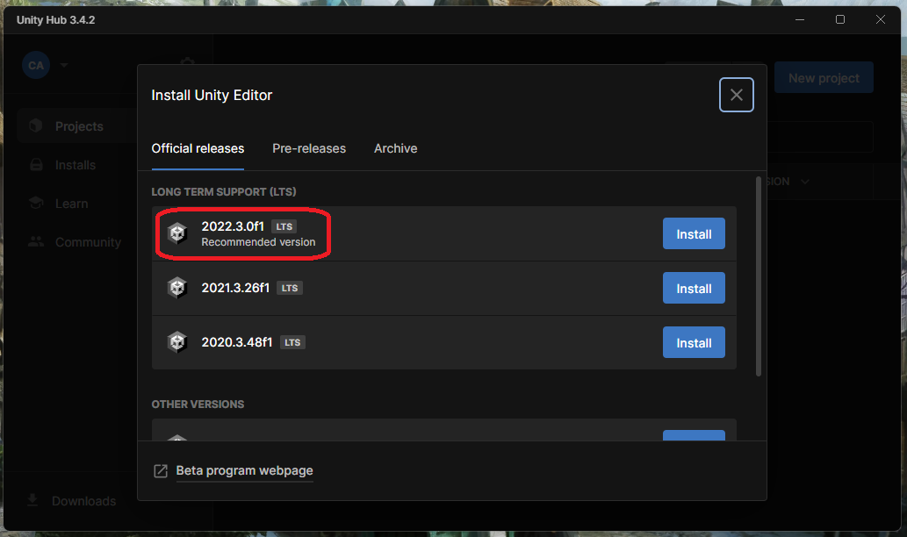
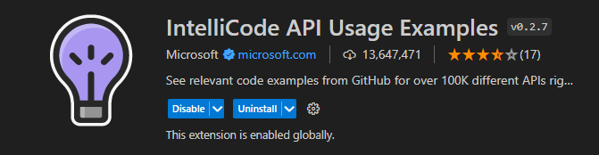
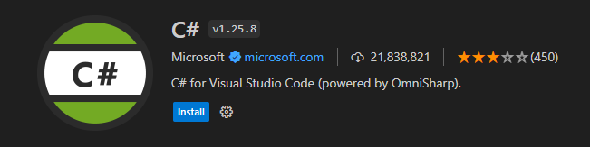

# **GameJam_TW_2023**

First things first, WELCOME to our official Game Jam Repo! I'll start off by giving some instructions, so we can all be on the same page for friday (02/06).


# 1 - Accounts
We will need to have some registration done for us to work smoothly during the weekend, so I listed here the most important ones for you to have ready.

## Itch.io
---
Our game shall be submitted to a site called [itch.io](https://itch.io) for us to compete in the game jam. This site is a cool place for indie developers and creators to share content about game development and even their new indie games.

Being aware of that, I must ask all of you to create an account there. I have created one myself a while ago (this is my [profile](https://angelion879.itch.io)) and if you need any help with it, dont hesitate on calling me!

## Unity
---
In order to prepare the enviroment easily, Unity sometimes requise us to create an account. Don't worry, though, for you can have a free one without any issues. Just visit the official site [here](https://unity.com) and you can create one with Google or anything that makes you more comfortable with.

# 2 - Enviroment
```
 - In order to develop, we will need...?
 - A pact with some Eldrich God and a blood sacrifice?
 - ... Almost. Unity.
 - THAT'S LITERALLY THE SAME THING!
```

## Unity Hub
---
Yup, we will need Unity. But don't you worry, my fellow adventurer, for I will walk through the valley of death by your side!
To start things up, please download [UnityHub](https://unity.com/download), it will make the setup much easier!

## Unity Editor
---
Once you have finished the instalation process of UnityHub, go ahead and open it. It'll almost immediatly ask you to download the **UnityEditor**. You can confirm that you'll install it, and then it'll open a page for you to select which one of them you want to install.

In order to keep everyone in the same version and keep it as updated as possible, we'll use version **2022.3.0f1 LTS**. You can select it. In the next step it'll offer you to download modules. 



Please remember to check the last box, the *Documentation* one. Other than that, you can download any modules you want, but personally I recommend you to check *out* the box of the Microsoft Visual Studio. It's the standart code editor for unity, but it consumes more RAM. I usually use Visual Studio Code.


#### *Note: I'm counting with the possibility that we all have a Windows computer. If you have a MacOS or a Linux, let me know in order to help you through any dificulties of the process.*

## Visual Studio Code
---
If you haven't installed it on your machine yet, I'll leave the link [here](https://code.visualstudio.com). You can add whichever plugins that makes you comfortable with coding and prepare your enviroment as you like, I just have a few suggestions:

  **1. IntelliCode API**
  

  **2. C# for Visual Studio Code**
  
